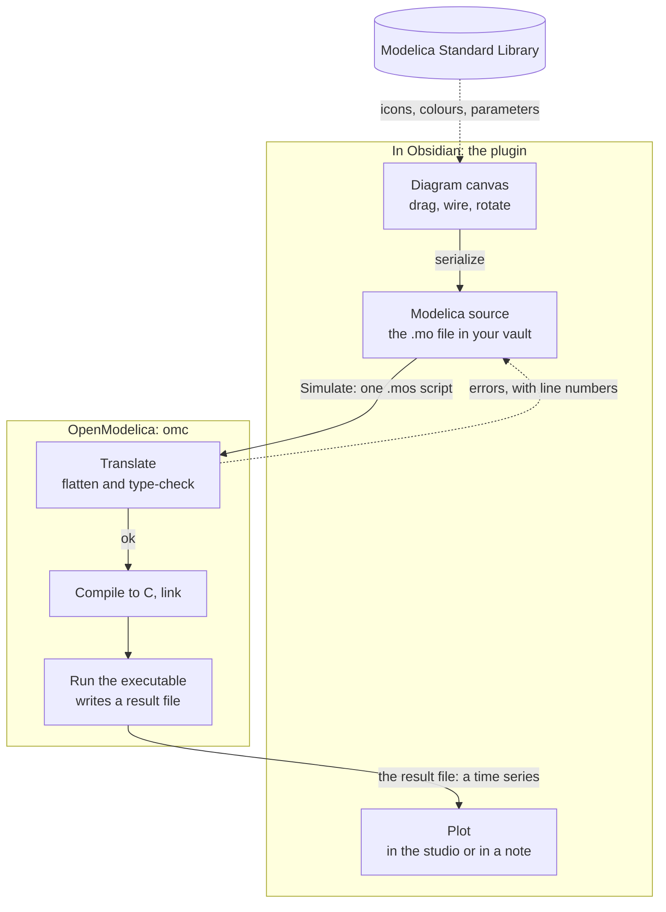

# Modelica Studio

Model, simulate and plot **Modelica** systems inside Obsidian: drag components onto
a schematic canvas, wire them, run them with the OpenModelica already installed on
your machine, and read the result as a plot — in the studio, or in the note itself.

<table>
<tr>
<td width="50%"></td>
<td width="50%"></td>
</tr>
<tr>
<td><sub>Light theme</sub></td><td><sub>Dark theme</sub></td>
</tr>
</table>

*`MassSpringDamper` — two free masses joined by a spring and damper, with a 1 N step forced on the first. The signal wire is the Blocks library's dark blue, the mechanical wires are translational green: colours and line weights come from the library's own annotations, not from this plugin — including on a dark canvas, where a wire that would vanish is lifted just enough to stay visible.*

**Status: pre-1.0**, and experimental — it works, its examples are verified
numerically against independent calculations, and there are rough edges. See
[Beta status](#beta-status).

- [Install](#install) · [What it does](#what-it-does) ·
  [Documentation](#documentation) · [Beta status](#beta-status) · [Licence](#license)

---


## Install

**Requirements:** Obsidian 1.11.4+ on **desktop** (it runs a compiler — mobile is
not supported), and **OpenModelica** installed separately. The plugin finds `omc`
on your PATH, tells you if it is missing, and uses the Modelica Standard Library
that ships with it.

Where to get OpenModelica — the same list the plugin prints when it cannot find `omc`:

| Platform | How to install it |
|---|---|
| **Arch Linux, CachyOS** | [`openmodelica-bin`](https://aur.archlinux.org/packages/openmodelica-bin) from the AUR — `yay -S openmodelica-bin` (or `openmodelica`, which builds from source). |
| **Other Linux distributions** | The [Linux downloads page](https://openmodelica.org/download/download-linux/) has the official packages; most distributions also carry it in their own repositories — Fedora: `sudo dnf install openmodelica`. |
| **macOS** | The [macOS installer](https://openmodelica.org/download/download-mac), then reload Obsidian. |
| **Windows** | The [Windows installer](https://openmodelica.org/download/download-windows), keeping **Add OpenModelica to PATH** checked. |

After installing, reload Obsidian (Ctrl/Cmd+R): the plugin looks for `omc` when it
loads. If it cannot find it, the message names the install route for your platform,
and **OpenModelica path** in the settings takes an explicit path to the binary.

### With BRAT, which keeps it updated

[BRAT](https://tfthacker.com/BRAT) installs a plugin straight from its GitHub
releases and updates it for you. The plugin is pre-1.0, so the version numbers are
0.x; from 0.3.0 the releases are ordinary releases rather than pre-releases, and the
0.2.0-beta.* line stays available for anyone pinning an older build.

1. Install **BRAT** from Settings → Community plugins → Browse.
2. In BRAT's settings, **Add Beta Plugin**.
3. Enter this repository: `AhmedAlfahdi/modelica-studio`
4. BRAT installs the latest release. Enable **Modelica Studio** in
   Settings → Community plugins.

To pin a version instead of tracking the latest, use BRAT's **frozen** option and
name the release, for example `0.3.18`.

BRAT reports a mismatch if a release's tag, its name and the version inside the
released `manifest.json` disagree. They are kept identical here on purpose, so an
update is never held back by a version string.

### By hand

1. Take `main.js`, `manifest.json` and `styles.css` from a release, or build them
   (below).
2. Create `<your-vault>/.obsidian/plugins/modelica-studio/`.
3. Copy those three files into it.
4. **Reload Obsidian** — a plugin's `manifest.json` is read at startup, so copying
   one in while the app is running does not register it.
5. Enable **Modelica Studio** in Settings → Community plugins.

To try it without your own vault, `examples/vault/` is a ready-made one — see
[Testing and verification](docs/verification.md).

### Verify what you installed

The three files on a release are built by
[`.github/workflows/release.yml`](.github/workflows/release.yml) from the tagged commit
and carry a **signed build-provenance attestation**, so you can check that the `main.js`
running in your vault came from this repository rather than from somewhere else:

```bash
gh attestation verify main.js --repo AhmedAlfahdi/modelica-studio
```

Run it inside your vault's `.obsidian/plugins/modelica-studio/` — or against any release
download — with the [GitHub CLI](https://cli.github.com) installed. A release from before
0.3.20 has no attestation; the command says so rather than pretending otherwise.

### Build it yourself

```bash
npm install
npm run build          # typecheck, then bundle to main.js
npm run dev            # rebuild on change
npm test               # ~790 tests, including a numerical audit of the examples
npm run lint           # the plugin directory's own review rules
```

`npm run lint` runs `eslint-plugin-obsidianmd`'s recommended config over the source and
the CSS checks the directory's published stylelint config applies to `styles.css` — the
same rules a submission is reviewed with — so that list is never seen for the first time
during a review. `test/lint.test.mjs` fails the suite when either is not clean, and
carries a canary proving the CSS gate still rejects `:has()` and `display: contents`
rather than passing because it stopped looking.

`npm test` runs the real OpenModelica compiler, so it needs `omc` on your PATH and
takes a few minutes. Without it, the simulation-dependent tests skip.

---

## What it does

Each of these is a capability, with the picture that goes with it. The screenshots
are rendered from the plugin's own code by `scripts/readme-images.mjs`, so they
cannot show something the plugin does not do — and regenerating them after a change
is one command.

The whole studio — palette, diagram, inspector, result — looks like this:


*Light theme. The palette on the left, the diagram in the middle, the inspector on the right — here on the **Traces** tab, listing the result's 37 variables with two of them plotted — and the result below, with the sweep controls beside it. The names under the components are placed by the plugin: a name that would land on another symbol or on a wire is moved aside, which is the **Move names out of the way** setting.*


*Dark theme.*

### How it talks to OpenModelica

The plugin never implements a simulator. It writes a model out as Modelica source,
hands that text to the `omc` you already have installed, and reads the result file
back:



Nothing is hidden in the middle: **Simulate** is those four steps in order, and
everything `omc` reports comes back with its line number and is shown against the
code. The library is read once to draw the palette and the symbols, and the model
`import`s it by its ordinary name — so a file written here compiles in any other
Modelica tool too.

### A schematic editor that draws what the library declares

Drag a class from the palette onto the canvas, wire the pins, drag a wire vertex to
route it, rotate, resize, copy and paste, undo. The search is fuzzy (`tank` finds
`OpenTank`), whole libraries can be hidden, and the diagram is stored as real
Modelica source with graphical annotations — so a file round-trips through OMEdit
and the other Modelica tools.

Symbol outlines, wire colours, wire weights and pin shapes are read from the
library: an electrical connection is the electrical blue, a shaft is ink, a bus is
yellow at double width, and a component's own icon text (`R=100`, a valve's state)
is drawn as the library wrote it. **Help → Diagrams** lists every domain's colour,
measured from the installed library rather than copied into the source.

### Run it, and read the result where you are

**Simulate** serializes the diagram, compiles it with `omc`, runs it and plots the
result. Traces are grouped onto one or two value axes by magnitude, so a pressure
in the hundreds of thousands and a flow in hundredths are both readable; the legend
names the run, and the cursor reads every visible trace at the instant under it.

<table>
<tr>
<td width="50%"></td>
<td width="50%"></td>
</tr>
<tr>
<td><sub>Light theme</sub></td><td><sub>Dark theme</sub></td>
</tr>
</table>

*The first mass's position and the coupling's deflection — the two quantities this
model is about, and the two its example opens with. Nothing is anchored, so
`mass1.s` drifts upward; `coupling.s_rel` is the gap, which rings and settles at
`F·m₂/(c(m₁+m₂)) = 1/75 m` rather than at `F/c`, because both ends are free. Both
curves are the numbers OpenModelica returned; nothing in this README is redrawn by
hand.*

A **sweep** runs the model once per value of one parameter and overlays the results
as a family, dotted per run; **Δ vs** measures a trace against the run on screen, so
"this valve opens 12 ms later" is a number rather than an impression. A changed
*parameter* re-runs in tens of milliseconds by overriding it in the compiled binary;
a structural change recompiles.

### The same thing, in a note

A fenced `modelica` block renders a live diagram and a plot in the note itself, and
simulates when the note opens. The block's text is the model, so the diagram travels
with the note and can be diffed, copied and committed like any other text.

It carries its own toolbar, takes options from a directive on its first line, and runs
itself exactly once — [Using it in a note](docs/notes.md) explains why, and what the
directive can set.

### A calculation, solved instead of typed

A fenced `modelica-solve` block holds a relationship rather than a number, and the
answer is recomputed when the note opens:

> `sqrt(x) + x^2 - 56 = 67`
>
> **x = 10.940400921**

The unknown does not have to be alone on the left of anything. The block asks
OpenModelica for the model's **initialisation** — the nonlinear solve it performs
before every simulation — so nothing is rearranged, by you or by the plugin.

It is not only arithmetic. Each of these has been run against OpenModelica, and the
answer is the one that came back:

| Write | Get |
|---|---|
| `2*x + y = 7` and `x - y = 2` | **`x = 3`**, **`y = 1`** — a system, solved together |
| `R = v/i`, the quantities declared as `Modelica.Units.SI.*` | **`R = 200 Ohm`** — the unit comes from the compiler, not the note |
| `Modelica.Math.Nonlinear.quadratureLobatto(Modelica.Math.exp, 0, 1, 1e-8)` | **`1.71828182846`** — a definite integral, by adaptive quadrature |
| `sum(sin((i - 0.5) * dx) * dx for i in 1:n)`, `n = 2000` over `0 … π` | **`2.00000020562`** — one of your own, as a midpoint sum |
| `x^2 + 3*x - 10 = 0` | **`x = 2`** — the root nearest the starting value, not the first found |

The equation above each answer is typeset where it can be read as mathematics, and
kept as source where it cannot — so a comprehension stays legible while everything
around it is drawn.

[The calculation block](docs/solve-block.md) is the reference, and
[twelve examples to try](docs/solve-examples.md) have each been run against
OpenModelica.

### Help that quotes the library

The Help window, in the studio, carries the shortcuts (read from the code that
implements them, so a key that does not exist cannot be documented), the domain
colours, the connection rules quoted from the library's own documentation, and what
this installation actually is — the OpenModelica version, the library, the class
count.

<table>
<tr>
<td width="50%"></td>
<td width="50%"></td>
</tr>
<tr>
<td><sub>Light theme</sub></td><td><sub>Dark theme</sub></td>
</tr>
</table>

*Every colour in that table is measured from the installed library by a test, so a row cannot describe a library that no longer says it. The connection rules are quoted from the library's own UsersGuide.*

### Ask the diagram what it is set to

Resting the pointer on a component shows what its parameters are set to — the ones
*this instance* overrides first, so the answer to "why is this different from the
library default" is one hover away. Reading a diagram's settings otherwise means
selecting every component in turn.

<table>
<tr>
<td width="50%"></td>
<td width="50%"></td>
</tr>
<tr>
<td><sub>Light theme</sub></td><td><sub>Dark theme</sub></td>
</tr>
</table>

*Resting on the coupling in `MassSpringDamper`: `c=50, d=1`, the two values this instance sets, with the library's own defaults for the rest. On a class with a conditional connector, the connector is dimmed and cannot be wired until the parameter that declares it is on.*

### Sweep a parameter, and measure the difference

A **sweep** runs the model once per value of one parameter and overlays the results as
a family — the run on screen solid, the others dashed, so which curve is which is
never in doubt. **Δ vs** then reads how far each member is from the run on screen at
the cursor, which turns "this valve opens a little later" into a number.

<table>
<tr>
<td width="50%"></td>
<td width="50%"></td>
</tr>
<tr>
<td><sub>Light theme</sub></td><td><sub>Dark theme</sub></td>
</tr>
</table>

*`MassSpringDamper` swept over the coupling stiffness — `c=25`, `c=50` (the run on screen) and `c=100` — with each family member's distance from it at the cursor. Each value is one simulation of the *same* compiled binary: a parameter change overrides it at run time, which is why a sweep is seconds rather than minutes. A structural change recompiles.*

### The rest of it

- **Diagram and code modes.** The same model, built by dragging or edited as source
  with syntax highlighting, completion from the library, and inline diagnostics.
- **Models as files.** Create a model and save it as `.mo`. Models go into a
  `Modelica/` folder at the vault root by default — they are source for a compiler,
  not notes. A saved model opens four ways: right-click → *Open in Modelica Studio*,
  drag it onto the canvas or the code pane, the command palette, or click it and
  read the source as text (that last one is deliberately still the default: the file
  *is* source).
- **Parameters, without hunting.** Hovering a component shows what its parameters
  are set to, with the ones this instance overrides first. A connector a class only
  declares conditionally — a heat port before `useHeatPort` is true — is dimmed and
  cannot be wired until the parameter is on.
- **Optional AI assistance.** With your own API key, describe a model in words and
  have it written into the editor, or ask for a compile error to be fixed. See
  [AI assistance](docs/ai.md).
- **30 worked examples** across electrical, mechanical, fluid, thermal, aerospace,
  control and discrete domains, each with a derivation, the live model, and a table
  comparing an independent calculation against the simulation. Every table is re-checked
  against a real OpenModelica run by `test/audit.test.mjs` on every test run, so a stale
  number fails the suite rather than misleading a reader.
- **A record of what went wrong.**
  [Testing findings](docs/testing-findings.md) lists every expectation that failed,
  which side was wrong, and the five models dropped for being unverifiable.

### What it accesses, and what leaves your machine

Stated plainly, because a plugin that runs a compiler should say so. The plugin
directory's own analysis flags five capabilities here; this is what each one is for.

| Capability | What it is used for |
|---|---|
| **Runs a shell command** | `omc`, the OpenModelica compiler: translate, compile and run a model. Nothing else is executed, and only when you press Simulate, Sweep, Check or Rebuild, or when a note containing a `modelica-solve` block is opened. |
| **Reads files outside the vault** | The Modelica Standard Library of your installed OpenModelica (to index classes for the palette), and its own cache, history and logs under your Obsidian configuration folder. No file is scanned for anything but `.mo` source. |
| **Machine details** | Your home directory, to find OpenModelica's library folder; whether Obsidian runs in a Flatpak or a Snap, to find `omc` inside it; the core count, to default the compiler's parallel jobs. **No hostname, no username, no hardware serial, no network interfaces** — and none of it is ever sent anywhere. |
| **Lists your vault's files** | **Model list…** and the embed picker: they show the `.mo` files that exist, so you can open one. The list is not stored or sent. |
| **The clipboard** | Copy and paste *inside the plugin* — a component, a selection, the model as text — and the `Ctrl+C`/`Ctrl+V` you already expect. It is read only when you paste, and written only when you copy. |

**Files, and what for.** Everything inside your vault is reached through Obsidian's
own API, and the plugin writes only where you ask it to: `.mo` files in the model
folder (`Modelica/` by default), the diagrams you embed in notes, and its own state
under your Obsidian configuration folder (`<config>/plugins/modelica-studio/` —
history, the library index cache, and optionally an AI request log). The one other
file it writes is `.modelica-studio.log` in the vault root, only when you turn
**Write diagnostic log** on, and it keeps its most recent 512 KB rather than growing
without end.

Outside the vault it touches two things, both because the compiler lives there:

- the **Modelica library folders** of your OpenModelica installation — on Linux
  `~/.openmodelica/libraries`, and the equivalent per-platform location elsewhere —
  read once to index the classes for the palette and the symbols, cached as JSON
  above, and re-read when a library changes;
- the **system temporary folder**, where `omc` translates and compiles a model
  (`<tmp>/modelica-studio/<pid>`). That is OpenModelica's own scratch space: a
  compiled model is tens of megabytes of generated C. It is not in your vault,
  nothing there is read by anything but the compiler, and the folders left by earlier
  sessions — whose process has exited, so nothing can reuse them — are removed when
  the plugin starts. A folder belonging to a running Obsidian is left alone.

Nothing else is read or written, and no file is uploaded anywhere.

**One file to read.** The plugin's whole system surface — every file it reads and writes,
the compiler it spawns, the hashes it computes, the environment it looks at — is reached
through `src/host/node.ts`, which declares exactly those calls. No other file in the
source imports a Node module or touches `process`, and a test fails the suite if one does.
That file is the complete answer to "what does this plugin do to my machine".

**Network.** The plugin makes **no network requests unless you turn on AI
assistance**. With it off — the default, and it stays off until you enter a key — it
works entirely offline. With it on, and only when you press **AI**, it sends the
prompt you wrote, the current model source, and OpenModelica's compiler output for
that model to the provider you configured:

- OpenAI (`api.openai.com`), DeepSeek (`api.deepseek.com`), Groq (`api.groq.com`) or
  OpenRouter (`openrouter.ai`), or
- any OpenAI-compatible base URL you type in instead, including a local Ollama or
  llama.cpp server — in which case nothing leaves the machine.

What it sends is the prompt, the model source, the compiler's output, the OpenModelica
**version**, the names of the libraries you have indexed, and your run settings. It does
not send file paths, your vault's contents, or anything identifying the machine.

The **benchmark** (`modelicaStudio.bench()`, documented under [Debugging](docs/debugging.md))
is the one exception, and it is a developer tool: it measures a fixed set of prompts and
reports the timings, from your console.

The key is stored in Obsidian's keychain and sent only to that provider. The plugin
has **no telemetry, no analytics and no update check**: it never contacts this
repository or anyone else on its own, and updating is Obsidian's or BRAT's job.
There is no account to create and nothing to pay for; the only cost of the AI
feature is your own provider bill.

---

## Documentation

The README is the front door: what the plugin is, how to install it, and what it does.
The reference is in [`docs/`](docs/), one page per subject.

| Page | What is in it |
|---|---|
| [A worked example](docs/examples.md) | Two masses and a spring, an RLC circuit that rings, and a resistor heating itself — with the numbers and where they come from |
| [Using it in a note](docs/notes.md) | The diagram block, its directive, and why it runs itself once |
| [The calculation block](docs/solve-block.md) | An equation solved in a note: the directive, units, integrals, typesetting, and what it refuses |
| [Calculation examples](docs/solve-examples.md) | Twelve blocks to paste, with the answer each one gives |
| [AI assistance](docs/ai.md) | The repair loop, what is sent, and what has actually been measured |
| [Performance](docs/performance.md) | Timings, what the settings are worth, and the solver table |
| [Testing and verification](docs/verification.md) | How every number in this documentation is checked |
| [Debugging](docs/debugging.md) | The logs, the console handle, and recovering a lost model |
| [Design notes](docs/design.md) | Why it is built this way, and the measurements behind the decisions |
| [Testing findings](docs/testing-findings.md) | Every failed expectation, and what it turned out to be |
| [AI baseline](docs/ai-baseline.md) | One model measured, and what the measurement does not establish |
| [Bug audit](docs/audit-2026-09-24.md) | Every module read, and what the reading turned up |

## Beta status

Experimental, and it wants more testing. Specifically:

- **Requires Obsidian 1.11.4+**, for the keychain the AI feature stores its key
  in. Earlier builds are refused rather than downgraded to plain-text storage.
- **Tested against one OpenModelica build** (1.27.0) on one platform (Linux).
  Windows and macOS are untested, and so is every other OpenModelica version.
- **MSL 4.1.0 is what the examples use.** Other library versions have not been
  tried.
- **Not all of Modelica is supported.** Array-valued connectors, `redeclare
  model` refinements, and bitmap icons have known gaps. Conditional connectors
  are handled — they are dimmed and unwireable until their parameter is on —
  but an array port is not captured, so a class with one is reported rather than
  silently mis-drawn. Unsupported constructs surface as compiler errors rather
  than silently.
- **The audit covers the built-in examples, not your models.** A hand-built model
  may hit a parser or serializer limitation the examples do not.
- **No plugin-store review.** Nothing has been checked by anyone but its author.

If something fails, enabling **Write diagnostic log** in settings writes a diagnostic
log to `.modelica-studio.log` in the vault — the most recent 512 KB of it, trimmed as
it fills — and **Show coordinate diagnostics** overlays the editor's geometry.

## Repository layout

```
src/
  main.ts              plugin entry, commands, settings, embeds
  ai/                  prompt construction and the OpenAI-compatible client
  modelica/            parser, serializer, library index, examples
  render/              canvas drawing of Modelica graphical primitives
  view/                schematic editor, studio view, plots, inline blocks
  omc/                 OpenModelica process, build cache, result reading
test/                  unit and integration tests, and the numerical audit
showcase/              generator for the example notes (math, explanations)
examples/vault/        the test vault, with the generated notes
docs/                  the reference, one page per subject -- see Documentation above
  design.md            why it is built this way, and the measurements behind it
  testing-findings.md  every failed expectation and what it turned out to be
research/              background research kept from development
scripts/               bundle checks
```

## License

**GNU General Public License, version 3 or later** — see [`LICENSE`](LICENSE).
Copyright (C) 2026 Ahmed N. Alfahdi.

Use it for anything, including commercially, and change it however you like. Two
things come with that, and they are the point of choosing this licence:

- **It stays free.** Anyone who distributes this code or a modified version must
  pass on the same freedoms — the source has to come with it. Nobody can take it
  closed.
- **It stays attributed.** The copyright notice and this licence travel with every
  copy, and modified versions have to say that they are modified. A fork cannot
  present itself as the original work.

Nothing else is asked of you: running it, building models with it, publishing
results from those models, or using it inside a company are all unrestricted.

### Citing

If this plugin contributes to work you publish, please cite it — as a favour to a
student, not as a condition of the licence, because a citation requirement cannot
be part of an open-source licence (the [GNU FAQ](https://www.gnu.org/licenses/gpl-faq.html#RequireCitation)
says so explicitly, and Debian [patched exactly such a notice out of GNU `parallel`](https://bugs.debian.org/905674)).
GitHub's "Cite this repository" button reads [`CITATION.cff`](CITATION.cff), which
gives the version-independent form:

> Alfahdi, A. N. (2026). *Modelica Studio: a visual Modelica modelling and
> simulation environment for Obsidian* [Computer software].
> https://github.com/AhmedAlfahdi/modelica-studio

### Third-party notices

Neither Modelica nor OpenModelica is bundled, so neither licence reaches this
plugin:

- **OpenModelica** is installed separately and invoked as a separate program
  (`omc`); it is subject to its own licence.
- **The Modelica Standard Library** is not redistributed either — it is parsed from
  the copy already installed on the machine. It is licensed under the
  [3-Clause BSD licence](https://modelica.org/licenses/modelica-3-clause-bsd),
  which is compatible with this one. Two sentences of its documentation are quoted
  in the Help window, with their source named where they appear.
- **Obsidian's API** is imported at run time from the application, not distributed
  with the plugin. Icons are drawn by Obsidian's own `setIcon`, so the plugin ships no
  artwork.
- **[Lucide](https://lucide.dev)** is the icon set Obsidian draws those icons from.
  `scripts/readme-icons.json` holds the 29 shapes the toolbar and menus use, vendored
  under Lucide's [ISC licence](https://github.com/lucide-icons/lucide/blob/main/LICENSE)
  for one reason: the README's screenshots are rendered by a script, and without the
  shapes the toolbar came out as a row of empty squares. Nothing in the plugin reads
  that file.
