# Modelica Studio

Model, simulate and plot **Modelica** systems inside Obsidian: drag components onto
a schematic canvas, wire them, run them with the OpenModelica already installed on
your machine, and read the result as a plot — in the studio, or in the note itself.

<table>
<tr>
<td width="50%">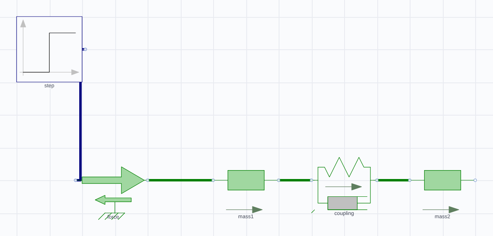</td>
<td width="50%">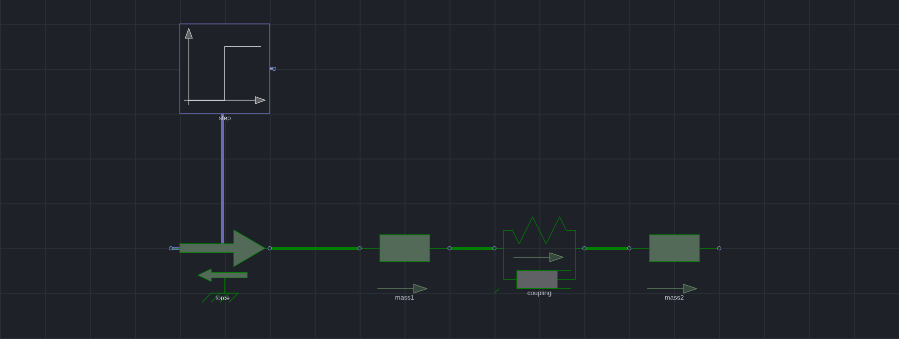</td>
</tr>
<tr>
<td><sub>Light theme</sub></td><td><sub>Dark theme</sub></td>
</tr>
</table>

*`MassSpringDamper` — two free masses joined by a spring and damper, with a 1 N step forced on the first. The signal wire is the Blocks library's dark blue, the mechanical wires are translational green: colours and line weights come from the library's own annotations, not from this plugin — including on a dark canvas, where a wire that would vanish is lifted just enough to stay visible.*

**Status: pre-1.0**, and experimental — it works, its examples are verified
numerically against independent calculations, and there are rough edges. See
[Beta status](#beta-status).

- [Install](#install) · [What it does](#what-it-does) ·
  [A worked example](#a-worked-example-two-masses-and-a-spring) ·
  [Two more examples](#two-more-examples) ·
  [Using it in a note](#using-it-in-a-note) · [AI assistance](#ai-assistance) ·
  [Testing and verification](#testing) · [Licence](#license)

---

## Install

**Requirements:** Obsidian 1.11.4+ on **desktop** (it runs a compiler — mobile is
not supported), and **OpenModelica** installed separately. The plugin finds `omc`
on your PATH, tells you if it is missing, and uses the Modelica Standard Library
that ships with it.

### With BRAT, which keeps it updated

[BRAT](https://tfthacker.com/BRAT) installs a plugin straight from its GitHub
releases and updates it for you. The plugin is pre-1.0, so the version numbers are
0.x; from 0.3.0 the releases are ordinary releases rather than pre-releases, and the
0.2.0-beta.* line stays available for anyone pinning an older build.

1. Install **BRAT** from Settings → Community plugins → Browse.
2. In BRAT's settings, **Add Beta Plugin**.
3. Enter this repository: `AhmedAlfahdi/modelica-studio`
4. BRAT installs the latest release. Enable **Modelica Studio** in
   Settings → Community plugins.

To pin a version instead of tracking the latest, use BRAT's **frozen** option and
name the release, for example `0.3.18`.

BRAT reports a mismatch if a release's tag, its name and the version inside the
released `manifest.json` disagree. They are kept identical here on purpose, so an
update is never held back by a version string.

### By hand

1. Take `main.js`, `manifest.json` and `styles.css` from a release, or build them
   (below).
2. Create `<your-vault>/.obsidian/plugins/modelica-studio/`.
3. Copy those three files into it.
4. **Reload Obsidian** — a plugin's `manifest.json` is read at startup, so copying
   one in while the app is running does not register it.
5. Enable **Modelica Studio** in Settings → Community plugins.

To try it without your own vault, `examples/vault/` is a ready-made one — see
[Testing](#testing).

### Verify what you installed

The three files on a release are built by
[`.github/workflows/release.yml`](.github/workflows/release.yml) from the tagged commit
and carry a **signed build-provenance attestation**, so you can check that the `main.js`
running in your vault came from this repository rather than from somewhere else:

```bash
gh attestation verify main.js --repo AhmedAlfahdi/modelica-studio
```

Run it inside your vault's `.obsidian/plugins/modelica-studio/` — or against any release
download — with the [GitHub CLI](https://cli.github.com) installed. A release from before
0.3.20 has no attestation; the command says so rather than pretending otherwise.

### Build it yourself

```bash
npm install
npm run build          # typecheck, then bundle to main.js
npm run dev            # rebuild on change
npm test               # ~790 tests, including a numerical audit of the examples
npm run lint           # the plugin directory's own review rules
```

`npm run lint` runs `eslint-plugin-obsidianmd`'s recommended config over the source and
the CSS checks the directory's published stylelint config applies to `styles.css` — the
same rules a submission is reviewed with — so that list is never seen for the first time
during a review. `test/lint.test.mjs` fails the suite when either is not clean, and
carries a canary proving the CSS gate still rejects `:has()` and `display: contents`
rather than passing because it stopped looking.

`npm test` runs the real OpenModelica compiler, so it needs `omc` on your PATH and
takes a few minutes. Without it, the simulation-dependent tests skip.

---

## What it does

Each of these is a capability, with the picture that goes with it. The screenshots
are rendered from the plugin's own code by `scripts/readme-images.mjs`, so they
cannot show something the plugin does not do — and regenerating them after a change
is one command.

The whole studio — palette, diagram, inspector, result — looks like this:

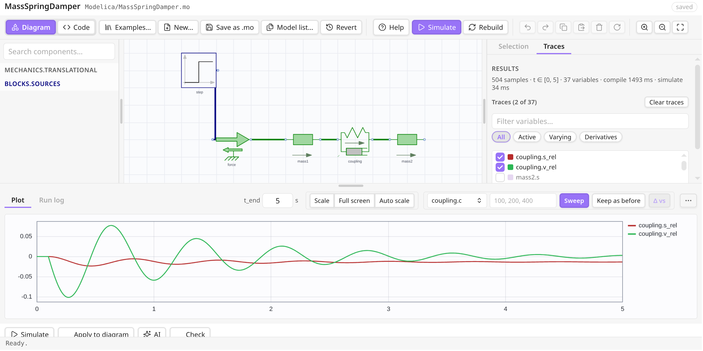

*Light theme. The palette on the left, the diagram in the middle, the inspector on the right — here on the **Traces** tab, listing the result's 37 variables with two of them plotted — and the result below, with the sweep controls beside it. The names under the components are placed by the plugin: a name that would land on another symbol or on a wire is moved aside, which is the **Move names out of the way** setting.*

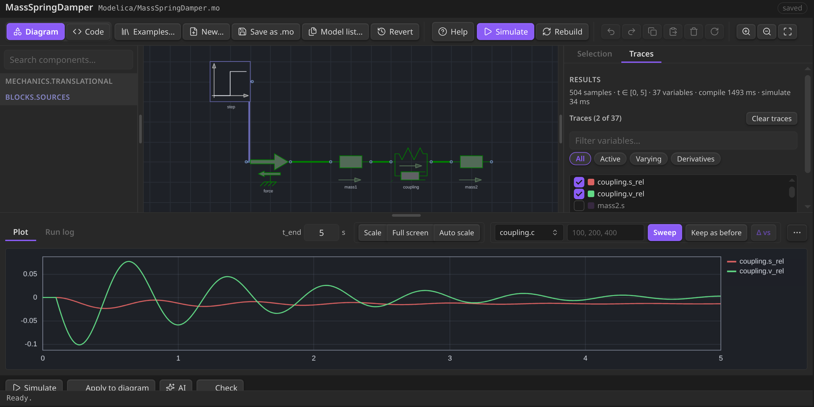

*Dark theme.*

### How it talks to OpenModelica

The plugin never implements a simulator. It writes a model out as Modelica source,
hands that text to the `omc` you already have installed, and reads the result file
back:

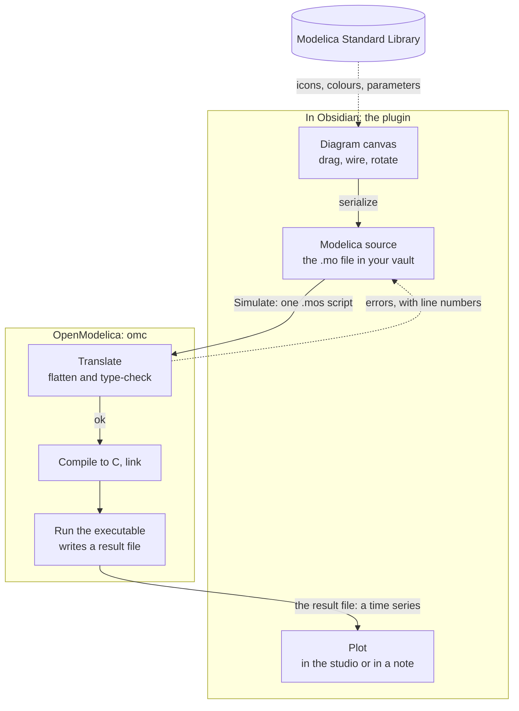

Nothing is hidden in the middle: **Simulate** is those four steps in order, and
everything `omc` reports comes back with its line number and is shown against the
code. The library is read once to draw the palette and the symbols, and the model
`import`s it by its ordinary name — so a file written here compiles in any other
Modelica tool too.

### A schematic editor that draws what the library declares

Drag a class from the palette onto the canvas, wire the pins, drag a wire vertex to
route it, rotate, resize, copy and paste, undo. The search is fuzzy (`tank` finds
`OpenTank`), whole libraries can be hidden, and the diagram is stored as real
Modelica source with graphical annotations — so a file round-trips through OMEdit
and the other Modelica tools.

Symbol outlines, wire colours, wire weights and pin shapes are read from the
library: an electrical connection is the electrical blue, a shaft is ink, a bus is
yellow at double width, and a component's own icon text (`R=100`, a valve's state)
is drawn as the library wrote it. **Help → Diagrams** lists every domain's colour,
measured from the installed library rather than copied into the source.

### Run it, and read the result where you are

**Simulate** serializes the diagram, compiles it with `omc`, runs it and plots the
result. Traces are grouped onto one or two value axes by magnitude, so a pressure
in the hundreds of thousands and a flow in hundredths are both readable; the legend
names the run, and the cursor reads every visible trace at the instant under it.

<table>
<tr>
<td width="50%">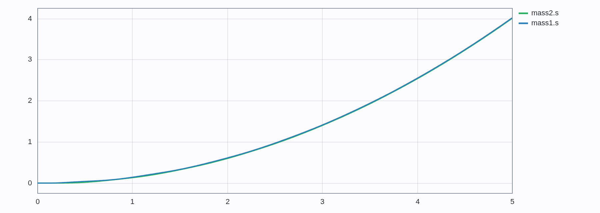</td>
<td width="50%">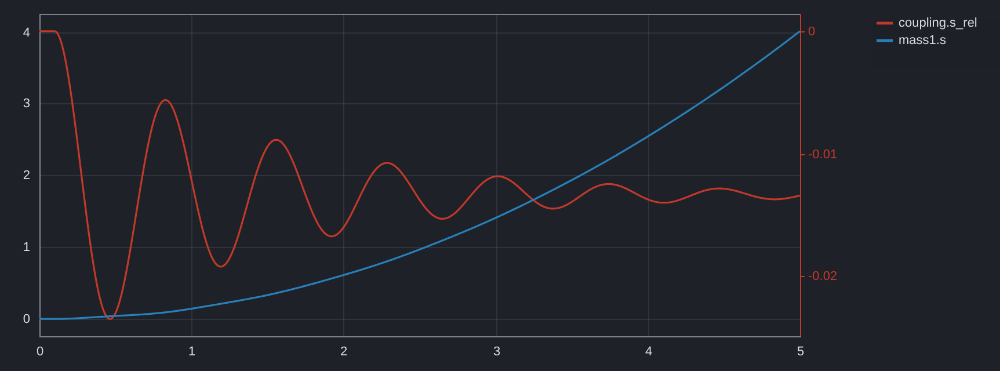</td>
</tr>
<tr>
<td><sub>Light theme</sub></td><td><sub>Dark theme</sub></td>
</tr>
</table>

*The first mass's position and the coupling's deflection — the two quantities this
model is about, and the two its example opens with. Nothing is anchored, so
`mass1.s` drifts upward; `coupling.s_rel` is the gap, which rings and settles at
`F·m₂/(c(m₁+m₂)) = 1/75 m` rather than at `F/c`, because both ends are free. Both
curves are the numbers OpenModelica returned; nothing in this README is redrawn by
hand.*

A **sweep** runs the model once per value of one parameter and overlays the results
as a family, dotted per run; **Δ vs** measures a trace against the run on screen, so
"this valve opens 12 ms later" is a number rather than an impression. A changed
*parameter* re-runs in tens of milliseconds by overriding it in the compiled binary;
a structural change recompiles.

### The same thing, in a note

A fenced `modelica` block renders a live diagram and a plot, and simulates when the
note opens. The block's text is the model — the one below is the `MassSpringDamper`
from the worked example — so the diagram lives in the note and the note travels with
it.

<table>
<tr>
<td width="50%">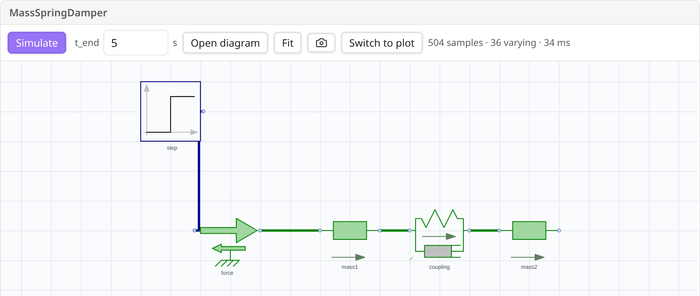</td>
<td width="50%">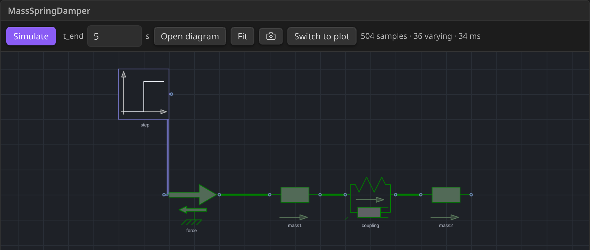</td>
</tr>
<tr>
<td><sub>Light theme</sub></td><td><sub>Dark theme</sub></td>
</tr>
</table>

*A block in a note, opened on its diagram. It carries its own toolbar: **Simulate**, the span it runs over, **Open diagram** to take the model into the studio, **Fit**, and the switch between the two panes. It simulates once when the note opens.*

<table>
<tr>
<td width="50%">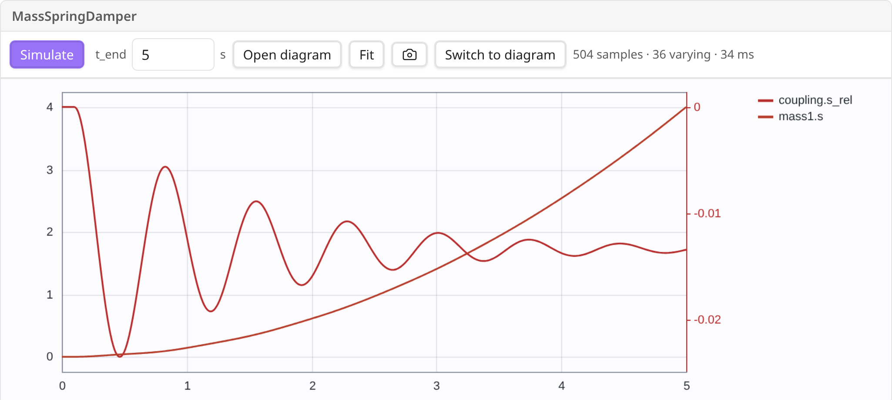</td>
<td width="50%">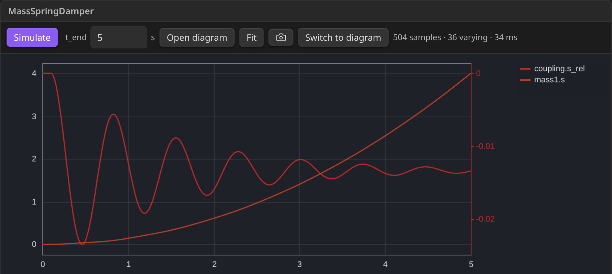</td>
</tr>
<tr>
<td><sub>Light theme</sub></td><td><sub>Dark theme</sub></td>
</tr>
</table>

*The same block on its plot — this is what `//@ result` in the block's first line opens on. The diagram is always there underneath, a scroll away: a plot is the result *of* the diagram, and hiding one to show the other loses the thing the reader came for.*

A block runs itself once, when the note opens; after that the **Simulate** button
starts a run. Dragging a component inside the block writes the note back — see
[Using it in a note](#using-it-in-a-note) for why that does not start a loop, and
what the directive on the block's first line can set.

### Help that quotes the library

The Help window, in the studio, carries the shortcuts (read from the code that
implements them, so a key that does not exist cannot be documented), the domain
colours, the connection rules quoted from the library's own documentation, and what
this installation actually is — the OpenModelica version, the library, the class
count.

<table>
<tr>
<td width="50%">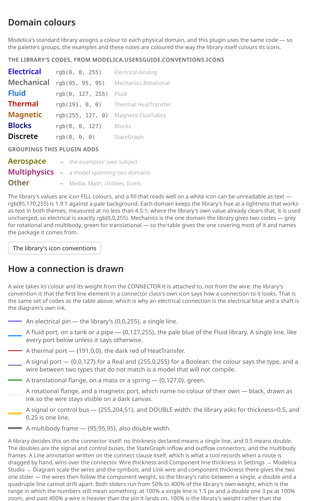</td>
<td width="50%">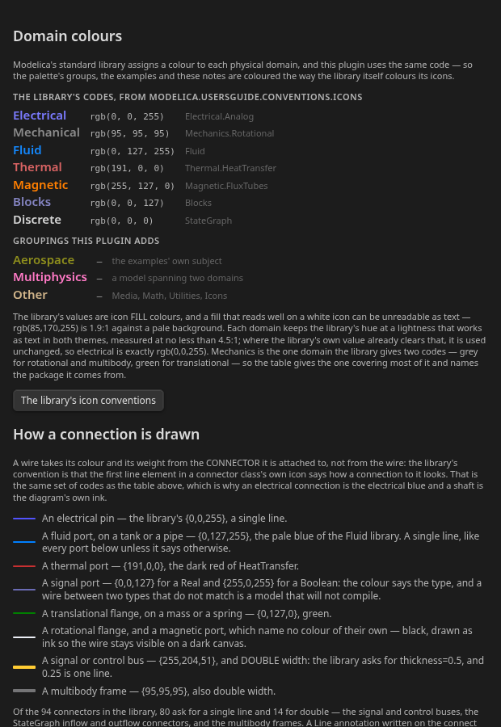</td>
</tr>
<tr>
<td><sub>Light theme</sub></td><td><sub>Dark theme</sub></td>
</tr>
</table>

*Every colour in that table is measured from the installed library by a test, so a row cannot describe a library that no longer says it. The connection rules are quoted from the library's own UsersGuide.*

### Ask the diagram what it is set to

Resting the pointer on a component shows what its parameters are set to — the ones
*this instance* overrides first, so the answer to "why is this different from the
library default" is one hover away. Reading a diagram's settings otherwise means
selecting every component in turn.

<table>
<tr>
<td width="50%">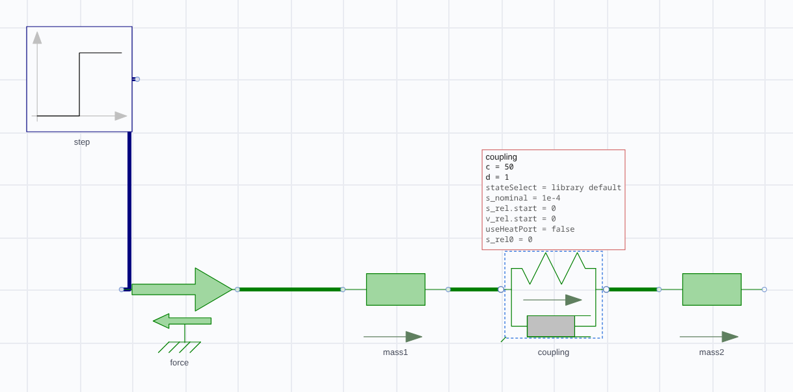</td>
<td width="50%">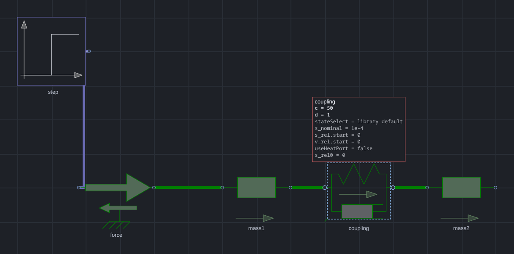</td>
</tr>
<tr>
<td><sub>Light theme</sub></td><td><sub>Dark theme</sub></td>
</tr>
</table>

*Resting on the coupling in `MassSpringDamper`: `c=50, d=1`, the two values this instance sets, with the library's own defaults for the rest. On a class with a conditional connector, the connector is dimmed and cannot be wired until the parameter that declares it is on.*

### Sweep a parameter, and measure the difference

A **sweep** runs the model once per value of one parameter and overlays the results as
a family — the run on screen solid, the others dashed, so which curve is which is
never in doubt. **Δ vs** then reads how far each member is from the run on screen at
the cursor, which turns "this valve opens a little later" into a number.

<table>
<tr>
<td width="50%">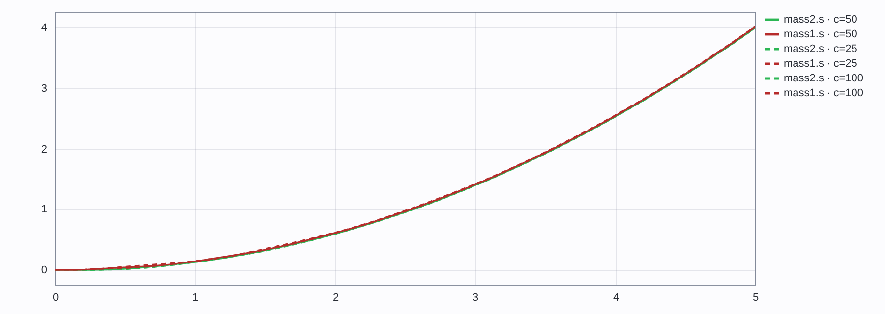</td>
<td width="50%">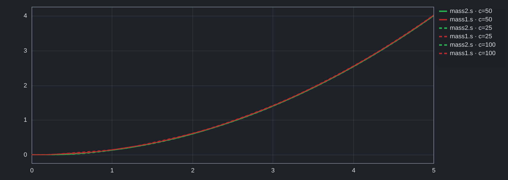</td>
</tr>
<tr>
<td><sub>Light theme</sub></td><td><sub>Dark theme</sub></td>
</tr>
</table>

*`MassSpringDamper` swept over the coupling stiffness — `c=25`, `c=50` (the run on screen) and `c=100` — with each family member's distance from it at the cursor. Each value is one simulation of the *same* compiled binary: a parameter change overrides it at run time, which is why a sweep is seconds rather than minutes. A structural change recompiles.*

### The rest of it

- **Diagram and code modes.** The same model, built by dragging or edited as source
  with syntax highlighting, completion from the library, and inline diagnostics.
- **Models as files.** Create a model and save it as `.mo`. Models go into a
  `Modelica/` folder at the vault root by default — they are source for a compiler,
  not notes. A saved model opens four ways: right-click → *Open in Modelica Studio*,
  drag it onto the canvas or the code pane, the command palette, or click it and
  read the source as text (that last one is deliberately still the default: the file
  *is* source).
- **Parameters, without hunting.** Hovering a component shows what its parameters
  are set to, with the ones this instance overrides first. A connector a class only
  declares conditionally — a heat port before `useHeatPort` is true — is dimmed and
  cannot be wired until the parameter is on.
- **Optional AI assistance.** With your own API key, describe a model in words and
  have it written into the editor, or ask for a compile error to be fixed. See
  [AI assistance](#ai-assistance).
- **30 worked examples** across electrical, mechanical, fluid, thermal, aerospace,
  control and discrete domains, each with a derivation, the live model, and a table
  comparing an independent calculation against the simulation. Every table is re-checked
  against a real OpenModelica run by `test/audit.test.mjs` on every test run, so a stale
  number fails the suite rather than misleading a reader.
- **A record of what went wrong.**
  [Testing findings](docs/testing-findings.md) lists every expectation that failed,
  which side was wrong, and the five models dropped for being unverifiable.

### What it accesses, and what leaves your machine

Stated plainly, because a plugin that runs a compiler should say so. The plugin
directory's own analysis flags five capabilities here; this is what each one is for.

| Capability | What it is used for |
|---|---|
| **Runs a shell command** | `omc`, the OpenModelica compiler: translate, compile and run a model. Nothing else is executed, and only when you press Simulate, Sweep, Check or Rebuild. |
| **Reads files outside the vault** | The Modelica Standard Library of your installed OpenModelica (to index classes for the palette), and its own cache, history and logs under your Obsidian configuration folder. No file is scanned for anything but `.mo` source. |
| **Machine details** | Your home directory, to find OpenModelica's library folder; whether Obsidian runs in a Flatpak or a Snap, to find `omc` inside it; the core count, to default the compiler's parallel jobs. **No hostname, no username, no hardware serial, no network interfaces** — and none of it is ever sent anywhere. |
| **Lists your vault's files** | **Model list…** and the embed picker: they show the `.mo` files that exist, so you can open one. The list is not stored or sent. |
| **The clipboard** | Copy and paste *inside the plugin* — a component, a selection, the model as text — and the `Ctrl+C`/`Ctrl+V` you already expect. It is read only when you paste, and written only when you copy. |

**Files, and what for.** Everything inside your vault is reached through Obsidian's
own API, and the plugin writes only where you ask it to: `.mo` files in the model
folder (`Modelica/` by default), the diagrams you embed in notes, and its own state
under your Obsidian configuration folder (`<config>/plugins/modelica-studio/` —
history, the library index cache, and optionally a debug log and an AI request log).

Outside the vault it touches two things, both because the compiler lives there:

- the **Modelica library folders** of your OpenModelica installation — on Linux
  `~/.openmodelica/libraries`, and the equivalent per-platform location elsewhere —
  read once to index the classes for the palette and the symbols, cached as JSON
  above, and re-read when a library changes;
- the **system temporary folder**, where `omc` translates and compiles a model
  (`<tmp>/modelica-studio/<pid>`). That is OpenModelica's own scratch space: a
  compiled model is tens of megabytes of generated C. It is not in your vault, and
  nothing there is read by anything but the compiler.

Nothing else is read or written, and no file is uploaded anywhere.

**Network.** The plugin makes **no network requests unless you turn on AI
assistance**. With it off — the default, and it stays off until you enter a key — it
works entirely offline. With it on, and only when you press **AI**, it sends the
prompt you wrote, the current model source, and OpenModelica's compiler output for
that model to the provider you configured:

- OpenAI (`api.openai.com`), DeepSeek (`api.deepseek.com`), Groq (`api.groq.com`) or
  OpenRouter (`openrouter.ai`), or
- any OpenAI-compatible base URL you type in instead, including a local Ollama or
  llama.cpp server — in which case nothing leaves the machine.

What it sends is the prompt, the model source, the compiler's output, the OpenModelica
**version**, the names of the libraries you have indexed, and your run settings. It does
not send file paths, your vault's contents, or anything identifying the machine.

The **benchmark** (`modelicaStudio.bench()`, documented under [Debugging](#debugging))
is the one exception, and it is a developer tool: it measures a fixed set of prompts and
reports the timings, from your console.

The key is stored in Obsidian's keychain and sent only to that provider. The plugin
has **no telemetry, no analytics and no update check**: it never contacts this
repository or anyone else on its own, and updating is Obsidian's or BRAT's job.
There is no account to create and nothing to pay for; the only cost of the AI
feature is your own provider bill.

---

## A worked example: two masses and a spring

The picture at the top of this page is this model — one of the built-in examples, so
you can open it from **Examples** in the toolbar and run it yourself:

```modelica
//@ time=5
model MassSpringDamper "Two masses coupled by a spring and damper"
  Modelica.Mechanics.Translational.Sources.Force force
    annotation(Placement(transformation(extent={{-80,-10},{-60,10}})));
  Modelica.Mechanics.Translational.Components.Mass mass1(m=1)
    annotation(Placement(transformation(extent={{-40,-10},{-20,10}})));
  Modelica.Mechanics.Translational.Components.SpringDamper coupling(c=50, d=1)
    annotation(Placement(transformation(extent={{-10,-10},{10,10}})));
  Modelica.Mechanics.Translational.Components.Mass mass2(m=2)
    annotation(Placement(transformation(extent={{20,-10},{40,10}})));
  Modelica.Blocks.Sources.Step step(height=1, startTime=0.1)
    annotation(Placement(transformation(extent={{-80,30},{-60,50}})));
equation
  connect(step.y, force.f);
  connect(force.flange, mass1.flange_a);
  connect(mass1.flange_b, coupling.flange_a);
  connect(coupling.flange_b, mass2.flange_a);
end MassSpringDamper;
```

A 1 N force is switched on at 0.1 s and pushes `mass1`; `mass2` is joined to it by
nothing but a spring and damper. **Nothing is bolted down**, which is what makes it
worth reading: the two masses bob relative to each other *and* drift away together,
and the gap between them settles somewhere other than the value a bolted-down end
would give it.

**Reduced mass** — the effective inertia of the relative motion, always smaller than
either mass alone.

$$\mu = \frac{m_1 m_2}{m_1 + m_2} = \frac{2}{3}\ \text{kg}$$

**Centre of mass** — nothing external holds the pair back, so the whole pair drifts
while the gap between them settles.

$$\ddot{x}_{\text{cm}} = \frac{F}{m_1 + m_2} = \frac{1}{3}\ \text{m/s}^2$$

**Steady gap** — the trap, if you expect the spring to carry the whole force.

$$\Delta x = \frac{F\,m_2}{c\,(m_1 + m_2)} = \frac{1}{75}\ \text{m}$$

[`showcase/notes/02-Mechanical/11-mass-spring-damper.md`](showcase/notes/02-Mechanical/11-mass-spring-damper.md)
works the whole thing through, including the equations and a table comparing them
with what the simulation returns.

---

## Two more examples

Every example below is built in — open it from **Examples** in the toolbar and press
**Simulate** — and every number is re-checked against a real OpenModelica run by
`npm test`, so a stale figure in this README fails the build rather than misleading a
reader. The closed forms are derived independently of the simulation.

### A series RLC circuit that rings

```modelica
//@ time=0.05
model RLC "Series RLC circuit: underdamped step response"
  Modelica.Electrical.Analog.Sources.StepVoltage source(V=10, startTime=0.001)
    annotation(Placement(transformation(extent={{-80,0},{-60,20}}, rotation=-90)));
  Modelica.Electrical.Analog.Basic.Resistor resistor(R=10)
    annotation(Placement(transformation(extent={{-40,20},{-20,40}})));
  Modelica.Electrical.Analog.Basic.Inductor inductor(L=0.1)
    annotation(Placement(transformation(extent={{0,20},{20,40}})));
  Modelica.Electrical.Analog.Basic.Capacitor capacitor(C=0.001)
    annotation(Placement(transformation(extent={{40,20},{60,40}})));
  Modelica.Electrical.Analog.Basic.Ground ground
    annotation(Placement(transformation(extent={{50,-40},{70,-20}})));
equation
  connect(inductor.n, capacitor.p);
  connect(source.p, resistor.p);
  connect(resistor.n, inductor.p);
  connect(capacitor.n, ground.p);
  connect(source.n, ground.p);
end RLC;
```

A 10 V step is switched on 1 ms into a series loop of a 10 Ω resistor, a 0.1 H
inductor and a 1 mF capacitor. The damping ratio decides everything, and it is one
line of algebra:

$$\alpha = \frac{R}{2L} = 50\ \text{s}^{-1}, \qquad
\omega_0 = \frac{1}{\sqrt{LC}} = 100\ \text{rad/s}, \qquad
\zeta = \frac{\alpha}{\omega_0} = \frac{R}{2}\sqrt{\frac{C}{L}} = 0.5$$

The damping ratio is below 1, so the step overshoots — by 16.3%, to 11.63 V, one
quarter of a ringing period after the step — and then rings down:

$$\omega_d = \sqrt{\omega_0^2 - \alpha^2} = 86.6\ \text{rad/s}, \qquad
\tau = \frac{1}{\alpha} = 20\ \text{ms}, \qquad
t_{\text{peak}} = \frac{\pi}{\omega_d} = 37\ \text{ms}$$

which is what the plot is checked against, point by point:

$$v_C(t) = V\left[1 - e^{-\alpha t}\left(\cos\omega_d t + \frac{\alpha}{\omega_d}\sin\omega_d t\right)\right]$$

| Quantity | Closed form | OpenModelica |
|---|---|---|
| `capacitor.v` at 5 ms | 0.6941 V | 0.694128 V |
| `capacitor.v` at 20 ms | 8.0618 V | 8.06181 V |
| `capacitor.v` at 50 ms | 10.8344 V | 10.8344 V |
| ζ from R, L, C | 0.5 | 0.5 |

### A resistor heating itself

One model, two domains, joined at a single port — the electrical side is
instantaneous, the thermal side integrates, and the port between them is what makes
it a system rather than two circuits:

```modelica
//@ time=200
model ResistorSelfHeating "A resistor self-heating: electrical loss into a thermal mass"
  Modelica.Electrical.Analog.Sources.ConstantVoltage supply(V = 10)
    annotation(Placement(transformation(extent={{-70,10},{-50,30}}, rotation=-90)));
  Modelica.Electrical.Analog.Basic.Resistor resistor(R = 10, useHeatPort = true)
    annotation(Placement(transformation(extent={{-30,10},{-10,30}}, rotation=90)));
  Modelica.Electrical.Analog.Basic.Ground return_path
    annotation(Placement(transformation(extent={{-50,-10},{-30,10}})));
  Modelica.Thermal.HeatTransfer.Components.HeatCapacitor body(C = 5, T(start = 293.15, fixed = true))
    annotation(Placement(transformation(extent={{20,20},{40,40}})));
  Modelica.Thermal.HeatTransfer.Components.ThermalConductor toAmbient(G = 0.5)
    annotation(Placement(transformation(extent={{50,10},{70,30}})));
  Modelica.Thermal.HeatTransfer.Sources.FixedTemperature ambient(T = 293.15)
    annotation(Placement(transformation(extent={{100,10},{120,30}})));
equation
  connect(resistor.heatPort, body.port);
  connect(body.port, toAmbient.port_a);
  connect(toAmbient.port_b, ambient.port);
  connect(resistor.p, supply.n);
  connect(resistor.n, supply.p);
  connect(resistor.p, return_path.p);
end ResistorSelfHeating;
```

Ten volts across ten ohms is one amp and ten watts, and every watt of it goes into
the body's thermal mass — 5 joules per kelvin — which can shed heat to still air only
at half a watt per kelvin:

$$P = \frac{V^2}{R} = 10\ \text{W}, \qquad
\tau = \frac{C}{G} = 10\ \text{s}, \qquad
\Delta T_\infty = \frac{P}{G} = 20\ \text{K}, \qquad
T(t) = T_\infty + \Delta T_\infty\left(1 - e^{-t/\tau}\right)$$

| Quantity | Closed form | OpenModelica |
|---|---|---|
| `resistor.LossPower` at t = τ | 10 W | 10.0000 W |
| `body.T` at t = τ = 10 s | 305.792 K | 305.793 K |
| `body.T` at t = 2τ | 310.443 K | 310.444 K |
| `body.T` at t = 20τ (steady) | 313.150 K | 313.150 K |
| `resistor.LossPower` − `toAmbient.Q_flow` at t = 3τ | 10 W | 10.0000 W |

The last row is the one worth having: it needs no closed form at all — what the
current makes, less what the body sheds, is what warms it — and it fails if the heat
port is wired to the wrong thing. The 30 notes under
[`showcase/notes/`](showcase/notes/) carry the same treatment for every example —
the algebra, then the numbers the simulation returns.

---

## Using it in a note

````markdown
```modelica
//@ time=5
model MassSpringDamper "Two masses coupled by a spring and damper"
  Modelica.Mechanics.Translational.Sources.Force force
    annotation(Placement(transformation(extent={{-80,-10},{-60,10}})));
  Modelica.Mechanics.Translational.Components.Mass mass1(m=1)
    annotation(Placement(transformation(extent={{-40,-10},{-20,10}})));
  Modelica.Mechanics.Translational.Components.SpringDamper coupling(c=50, d=1)
    annotation(Placement(transformation(extent={{-10,-10},{10,10}})));
  Modelica.Mechanics.Translational.Components.Mass mass2(m=2)
    annotation(Placement(transformation(extent={{20,-10},{40,10}})));
  Modelica.Blocks.Sources.Step step(height=1, startTime=0.1)
    annotation(Placement(transformation(extent={{-80,30},{-60,50}})));
equation
  connect(step.y, force.f);
  connect(force.flange, mass1.flange_a);
  connect(mass1.flange_b, coupling.flange_a);
  connect(coupling.flange_b, mass2.flange_a);
end MassSpringDamper;
```
````

That is the model from [the worked example](#a-worked-example-two-masses-and-a-spring)
— the same file the studio opens from **Examples** — so a block in a note and the
studio show the same diagram and the same numbers.

To put a block in a note, use the command palette: **Embed a simulation in the
current note** asks which model — the one open in the studio, a built-in example, or
a saved `.mo` file — and writes the block at the cursor with its options filled in.
**Embed the open model in the current note** skips the question.

The first line is an optional **directive**: `time` sets the simulation span,
`height` the height of the pane (the plot and the diagram are the same box, shown one
at a time), `result`/`edit` which of the two starts open, and `noauto`/`manual` to
keep the block from running itself at all. It lives inside the block because
Obsidian does not pass a fenced block's info string to a plugin.

**A block runs itself once**, when the note is opened. After that the **Simulate**
button is what starts a run — the plot has a `t_end` field beside it, and typing a
span there re-runs the block and records it in the directive. The reason is that an
edit made in a block's own diagram writes the note back, and a note that re-renders
rebuilds the block: without the rule, dragging one component ran four simulations.
A rebuilt block repaints the result it already had; if the model has changed since
that run, the line above the plot says so rather than the stale curve passing itself
off as current.

Blocks follow the studio: change the plot scale, the visible traces or the
simulation span there and the blocks follow, and a block re-simulates when a
parameter value it ran with changes. A block answers the pointer the way the studio
does — resting on a component shows its parameters, and moving across the plot reads
the time and every visible trace's value with a crosshair on it.

## AI assistance

Optional, off until an API key is entered.

1. Settings → Modelica Studio → AI assistance.
2. **API key** opens Obsidian's keychain: pick an existing secret, or create one.
   Pick a provider preset, or set the base URL and model directly. Any
   OpenAI-compatible endpoint works, including a local Ollama or llama.cpp
   server.
3. **Test** confirms the provider answers, and says what it said if it does not.
4. **Refresh model list** asks the provider which models it currently offers.
   Model names are retired without notice — `deepseek-chat` became
   `deepseek-flash` — and a retired name fails with an error that reads like a
   bad key, so the plugin fetches the list rather than shipping a stale one.

In the studio, switch to **Code** and press **AI**. Describe the model you want
and it is written, compiled and **repaired until it builds** — without further
input:

1. The request goes to the provider with the brief above attached.
2. The reply is **compiled** with OpenModelica.
3. If it fails, the compiler's own output — with its line and column numbers —
   goes back to the provider as the next request.
4. Steps 2 and 3 repeat until it compiles.

**You choose the form and the effort.** Two settings under AI assistance:

- **Model style** — *Diagram first* builds from library components, so you get a
  schematic you can see and rewire. A schematic depends on component paths,
  parameters and every connection being right, so the ways to fail outnumber the
  ways to succeed; equations have far less to get wrong. So if the diagram has
  had two attempts and still will not compile, the run **falls back to equations**
  automatically and says so. *Equations* skips straight there.
- **Reasoning effort** — *Off* / *Low* / *High* / *Max*. Providers that default to
  thinking spend that time on every request, and it silently disables Temperature.
  Off is fastest and suits code; raise it when attempts keep failing.

The loop stops when the model compiles, when the model returns the same source
twice, when the same error comes back twice (compared after stripping build
paths and timings, which differ on every attempt), when a provider error
occurs, or at five attempts. A model that compiles but has nothing that changes
with time counts as a **failure**, because OpenModelica builds it and then
refuses to simulate it.

Each step is reported as it happens — the attempt number, and the fault being
repaired — and **Stop** ends the run after the current step. Nothing is written
to the editor until a model compiles, so a run that produces nothing leaves your
model as it was.

**The Run log** tab keeps every simulation of the session: the model, the
parameters and run settings used, the timings, and on failure OpenModelica's
**complete output**. **Send to AI** hands that to the model and asks for a fix,
so a repair request is built from the compiler's own words rather than a
paraphrase — the first line of an OpenModelica error is usually a file path or
`Internal error`, and the line naming the fault comes several lines later.
**Copy** puts the same text on the clipboard for a bug report.

Every request also carries a standing brief about this installation, so the model
writes for the machine it is actually on rather than a generic one: the
OpenModelica version and path, the indexed libraries and how many classes they
hold, the run settings a simulation will use (span, intervals, tolerance,
solver), the libraries you have excluded, and the failures already in the log.
It is told not to add an `experiment` annotation, because the plugin applies the
run settings itself and an annotation conflicts with them.

The key lives in **Obsidian's keychain**, not in this plugin's `data.json`. Only
the *name* of the secret is stored with the plugin, so the value stays out of
vault backups, sync services and version control, and any other plugin can reuse
the same secret. It is never written to the debug log, never attached to an error
message, and only ever sent to the endpoint configured here.

This needs **Obsidian 1.11.4 or later**, which is where the keychain API arrived;
the plugin declares that as its minimum. On an older build the AI section says so
rather than falling back to storing a key in plain text.

If you configured a key with an earlier version of this plugin, it is still in
`data.json` and the settings page offers to move it into the keychain and delete
the plaintext copy.

Generated code is **unverified**: it is a draft to simulate and check, not an
answer. The request includes the current source and a shortlist of library
classes relevant to your description, so the model composes real MSL classes
instead of inventing names.

## Recovering a lost model

A saved model has three places it can still be found after the vault copy is gone:

1. **The plugin's history** — every save keeps the version it replaced, in the
   plugin's own folder (`.obsidian/plugins/modelica-studio/history/`), one
   directory per model. Twenty revisions are kept; **Model list…** in the studio
   shows them with restore.
2. **OpenModelica's build cache** — `/tmp/modelica-studio/*/<Model>/<Model>.mo`
   holds the exact source that was last compiled.
3. **The desktop trash** — `~/.local/share/Trash/files/` on Linux.

Deleting from **Model list…** uses the vault's own trash and snapshots first, so
that route is reversible twice.

## Debugging

The plugin logs to Obsidian's **developer console** (Ctrl+Shift+I) as well as to
`.modelica-studio.log` in the vault. It also publishes a handle for inspecting its
state live:

```js
modelicaStudio.help()        // what you can inspect
modelicaStudio.state()       // model, span, save path, toolchain, run count
modelicaStudio.source()      // the model as Modelica
modelicaStudio.model         // the parsed diagram
modelicaStudio.settings      // stored settings
modelicaStudio.library       // the class index
modelicaStudio.runLog        // every simulation this session
modelicaStudio.setVerbose(true)   // print every diagnostic line
modelicaStudio.trace()            // what the plugin held, step by step
```

The **run log** (the Run log tab under the results) and the **AI prompt log**
(Show the AI prompt log in the command palette) each have a **Copy** button, which
puts exactly what the pane is showing on the clipboard — for a bug report, or for
pasting into a prompt. A copy that the platform refuses says so rather than
claiming success.

`trace()` is the one for a suspected loss. The file log records what the plugin
**did**; the trace records what it **held** at each moment that changed — which
model, how long its source is, whether that source is still current, and which
file it will be written to:

```
      0ms  open    AirplaneDrag   src=2869 current=true comps=8 eqs=0 file=Modelica/AirplaneDrag.mo mode=code
   4200ms  edit    AirplaneDrag   src=2869 current=false comps=8 eqs=0 file=Modelica/AirplaneDrag.mo mode=diagram
   5100ms  adopt   AirplaneDrag   src=2874 current=true  comps=8 eqs=0 file=Modelica/AirplaneDrag.mo mode=code
   9800ms  switch  AirplaneDrag   src=2874 current=true  comps=8 eqs=0 file=Modelica/AirplaneDrag.mo mode=code
```

A `current=false` with no following `save` is the shape of a loss: the plugin was
holding an edit it had not written.

The log file is opt-in (**Write diagnostic log** in settings) because it survives
a reload and can be read from outside the app. The console needs no setting:
errors and warnings always print there, because a failure nobody can see is the
one that gets reported as "nothing happened".

## What is known about the AI

One model has been measured, not assumed: see
[`docs/ai-baseline.md`](docs/ai-baseline.md) for the method, the results, and
what they do **not** establish. In short, for `deepseek-flash`:

- diagram-first works — 8/8 compiled, 7 as fully wired diagrams across electrical,
  mechanical, thermal, fluid, multibody and control;
- the equations fallback earned itself, on one run out of eight;
- a hard request can take several minutes, because the repair loop is additive.

**No OpenAI model has been tested.** If you run one, `modelicaStudio.bench()` in
the developer console measures it, and the result belongs in
`docs/ai-baseline.json` as a new entry.

## Beta status

Experimental, and it wants more testing. Specifically:

- **Requires Obsidian 1.11.4+**, for the keychain the AI feature stores its key
  in. Earlier builds are refused rather than downgraded to plain-text storage.
- **Tested against one OpenModelica build** (1.27.0) on one platform (Linux).
  Windows and macOS are untested, and so is every other OpenModelica version.
- **MSL 4.1.0 is what the examples use.** Other library versions have not been
  tried.
- **Not all of Modelica is supported.** Array-valued connectors, `redeclare
  model` refinements, and bitmap icons have known gaps. Conditional connectors
  are handled — they are dimmed and unwireable until their parameter is on —
  but an array port is not captured, so a class with one is reported rather than
  silently mis-drawn. Unsupported constructs surface as compiler errors rather
  than silently.
- **The audit covers the built-in examples, not your models.** A hand-built model
  may hit a parser or serializer limitation the examples do not.
- **No plugin-store review.** Nothing has been checked by anyone but its author.

If something fails, enabling **Debug log** in settings writes a diagnostic log to
`.modelica-studio.log` in the vault, and **Show coordinate diagnostics** overlays
the editor's geometry.

## Testing

`examples/vault/` is an Obsidian vault you can open directly: the 30 worked
examples, cross-linked, each with a live model and its verified numbers, plus an
introduction to the language and a demonstration of using it to learn a new
subject.

1. Copy `main.js`, `manifest.json` and `styles.css` into
   `examples/vault/.obsidian/plugins/modelica-studio/`.
2. Open `examples/vault/` as a vault in Obsidian.
3. Enable the plugin, then open `showcase/00-modelica-intro.md`.

Start with the introduction, then any example, and press **Simulate** in a block.

Reports of what breaks are the most useful contribution at this stage. Include
the Modelica source, the error, and your OpenModelica version.

## Verification

Every built-in example is checked numerically against a value derived
independently of the plugin — a closed-form solution, an independent integration
of the same ODE, or the Modelica Standard Library source. The audit runs on every
`npm test`.

Where a check was not possible it says so rather than asserting a number: the
double pendulum is chaotic, so its total energy is checked (drift under 1%,
non-growing) instead of its trajectory; pipe friction depends on an empirical
correlation, so a mass balance is checked rather than a pressure drop.

Twelve expectations were themselves wrong when first written, and every one was
corrected only after tracing the discrepancy to the expectation rather than the
simulation. Not once was the solver at fault. The full account — what was
expected, what came out, which side was wrong and how it was settled — is in
[`docs/testing-findings.md`](docs/testing-findings.md), along with the five models
that were built, found unverifiable, and abandoned.

## Performance

Measured on the development machine — **Ryzen 5 2600X, 12 threads, 15 GB, NVMe,
OpenModelica 1.27.0, Modelica 4.1.0** — for a small MSL circuit. Every number below
is a wall-clock measurement, not an estimate.

The one thing worth knowing: **the first launch after installing or upgrading the
library costs about 1.2 s, and nothing else is slow.** Editing and re-running is
milliseconds.

### Startup

| Stage | Measured | When |
|---|---|---|
| Parse the whole MSL into the class index | **1.2 s** | first launch after install/upgrade |
| Load the index from its cache | **~0.3 s** | every launch after that |
| Cache file | 25 MB | written beside the plugin's data |

5984 classes are parsed out of 2424 files — 13 MB of library source. Only the
newest release of each library is read: OpenModelica keeps every installed
version side by side, and indexing all of them put three releases of `Modelica`
into one table keyed by class name, where the definition that won depended on the
order the filesystem handed the files over. The palette is built while this
happens rather than before it, so the index cost is not a delay in opening the
studio — it is why the palette fills in a moment late on a cold start.

### Editing and running

| Action | Measured | Why |
|---|---|---|
| Simulate with the binary already built | **18–36 ms** | the compiled model is reused |
| Change a parameter and re-run | **~30 ms** | applied as a run-time override, not a rebuild |
| Building the identical source again | **0 ms** | the fingerprint matches and the binary is reused |
| First build, small equation model | **0.6 s** | translate, generate C, compile, link |
| First build, 4-component MSL circuit | **1.5–1.8 s** | library classes bring their own equations |

The 30 ms row is why parameters are applied as run-time overrides rather than by
regenerating code, and why editing a value and re-simulating is immediate. Only a
structural change — adding a component, rewiring, editing an equation — pays for a
rebuild. Details in [`docs/design.md`](docs/design.md).

An edit that only changes a value, a start attribute or a run setting stays on the
fast path. So does switching between models that have both been built once.

### What the settings are worth

**Parallel compile jobs** is the setting that matters, and it is worth measuring
rather than guessing. Same 4-component circuit, cold cache, on the 12-thread CPU:

| `jobs` | First build | Saving |
|---|---|---|
| 1 | 4.07 s | — |
| 2 | 2.47 s | 39% |
| 4 | 1.75 s | 57% |
| 8 | 1.43 s | **65%** |

Each measured with an empty build cache and a freshly constructed backend, and
reproduced twice — the first attempt at this table compared contaminated figures,
since a backend remembers what it has already built and answered in 0 ms.

The default is one less than the core count. Raising it past the physical core
count does little, because code generation is CPU-bound.

**Excluded libraries** does not affect the timings above — the whole library is
still parsed — but it decides how much the studio has to offer. Excluding four
sub-libraries that many models never touch:

| | Placeable classes |
|---|---|
| Everything indexed | 1365 |
| After excluding `Magnetic`, `Clocked`, `ComplexBlocks`, `StateGraph` | 1089 |

A shorter palette is easier to search, and a shorter list in the AI's brief is
less to choose wrongly from.

### Choosing a solver

Leave it on **OpenModelica default** unless you have a reason. The list is what
this runtime offers, read from the runtime itself:

| Solver | What it is | Use it when |
|---|---|---|
| `dassl` | BDF, implicit, adaptive order 1–5 | the default; right for stiff systems |
| `ida` | SUNDIALS BDF, implicit, sparse | large systems, where the sparse solver scales better |
| `cvode` | SUNDIALS BDF or Adams–Moulton, order 1–12 | you want accuracy — measured **1e-16** against 8e-8 for `dassl` on a stiff problem |
| `gbode` | a family of Runge–Kutta methods, order 1–14, implicit or explicit | you want to try a non-BDF method, or multi-rate integration |
| `euler` | explicit, fixed step, order 1 | teaching, and seeing what a bad solver looks like |
| `rungekutta` | classical explicit RK, fixed step, order 4 | smooth non-stiff models; unstable on stiff ones |
| `symSolver`, `qss` | symbolic inline; quantised-state | experimental — `symSolver` needs a compiler flag this plugin does not pass |

**A stiff system** is one where something changes far faster than the interval you
care about — a fast electrical transient next to a slow thermal one. Explicit
methods take tiny steps to stay stable there; implicit ones like `dassl` and
`cvode` do not.

One caution worth knowing: **an unrecognised solver name is not an error to
OpenModelica.** It warns, exits successfully, and writes a result file full of
NaN. The name is `rungekutta`, not `rungekutta4` — and this plugin recommended the
wrong one until it was measured. The plugin now reports an all-NaN result as a
failure naming the solver, rather than showing an empty plot.

### Measuring it yourself

`modelicaStudio.state()` reports the toolchain, the index size and the settings in
force. The AI timings in [`docs/ai-baseline.md`](docs/ai-baseline.md) are measured
the same way: by running the thing and writing down what happened.

A different machine will differ, most in the compile column — that stage is
CPU-bound and parallel, so core count moves it more than anything else. If a
simulation feels slow, check `jobs` first, then whether the model is rebuilding
when it should not be.

## Repository layout

```
src/
  main.ts              plugin entry, commands, settings, embeds
  ai/                  prompt construction and the OpenAI-compatible client
  modelica/            parser, serializer, library index, examples
  render/              canvas drawing of Modelica graphical primitives
  view/                schematic editor, studio view, plots, inline blocks
  omc/                 OpenModelica process, build cache, result reading
test/                  unit and integration tests, and the numerical audit
showcase/              generator for the example notes (math, explanations)
examples/vault/        the test vault, with the generated notes
docs/
  design.md            why it is built this way, and the measurements behind it
  testing-findings.md  every failed expectation and what it turned out to be
research/              background research kept from development
scripts/               bundle checks
```

## License

**GNU General Public License, version 3 or later** — see [`LICENSE`](LICENSE).
Copyright (C) 2026 Ahmed N. Alfahdi.

Use it for anything, including commercially, and change it however you like. Two
things come with that, and they are the point of choosing this licence:

- **It stays free.** Anyone who distributes this code or a modified version must
  pass on the same freedoms — the source has to come with it. Nobody can take it
  closed.
- **It stays attributed.** The copyright notice and this licence travel with every
  copy, and modified versions have to say that they are modified. A fork cannot
  present itself as the original work.

Nothing else is asked of you: running it, building models with it, publishing
results from those models, or using it inside a company are all unrestricted.

### Citing

If this plugin contributes to work you publish, please cite it — as a favour to a
student, not as a condition of the licence, because a citation requirement cannot
be part of an open-source licence (the [GNU FAQ](https://www.gnu.org/licenses/gpl-faq.html#RequireCitation)
says so explicitly, and Debian [patched exactly such a notice out of GNU `parallel`](https://bugs.debian.org/905674)).
GitHub's "Cite this repository" button reads [`CITATION.cff`](CITATION.cff), which
gives the version-independent form:

> Alfahdi, A. N. (2026). *Modelica Studio: a visual Modelica modelling and
> simulation environment for Obsidian* [Computer software].
> https://github.com/AhmedAlfahdi/modelica-studio

### Third-party notices

Neither Modelica nor OpenModelica is bundled, so neither licence reaches this
plugin:

- **OpenModelica** is installed separately and invoked as a separate program
  (`omc`); it is subject to its own licence.
- **The Modelica Standard Library** is not redistributed either — it is parsed from
  the copy already installed on the machine. It is licensed under the
  [3-Clause BSD licence](https://modelica.org/licenses/modelica-3-clause-bsd),
  which is compatible with this one. Two sentences of its documentation are quoted
  in the Help window, with their source named where they appear.
- **Obsidian's API** is imported at run time from the application, not distributed
  with the plugin. Icons are drawn by Obsidian's own `setIcon`, so the plugin ships no
  artwork.
- **[Lucide](https://lucide.dev)** is the icon set Obsidian draws those icons from.
  `scripts/readme-icons.json` holds the 29 shapes the toolbar and menus use, vendored
  under Lucide's [ISC licence](https://github.com/lucide-icons/lucide/blob/main/LICENSE)
  for one reason: the README's screenshots are rendered by a script, and without the
  shapes the toolbar came out as a row of empty squares. Nothing in the plugin reads
  that file.
